# myTunes

A music search and playback app powered by the [iTunes Search API](https://developer.apple.com/library/archive/documentation/AudioVideo/Conceptual/iTuneSearchAPI/index.html). Search for songs, preview tracks, browse albums, and enjoy offline playback of previously played songs.

## Requirements

| | Minimum |
|---|---|
| **iOS** | 26.0 |
| **Swift** | 6.0 |
| **Xcode** | 26.0 |

### if running in simulators, avoid iOS 26.4 version, it has a problem with haptic library that lead the app to some lag when we use search the first time.

## Architecture & Patterns

- **MVVM** — Views are driven by `@Observable` ViewModels that own business logic and state.
- **Swift 6 Strict Concurrency** — The project uses `MainActor` as the default actor isolation (`SWIFT_DEFAULT_ACTOR_ISOLATION = MainActor`), ensuring thread-safe UI updates across the app.
- **SwiftData** — Used for persistent caching of recently played songs, albums, and track listings. Enables offline browsing of previously fetched content.
- **Dependency Injection** — ViewModels accept protocol-based dependencies (e.g. `SongsProviding`, `HTTPClient`) through their initializers, making them fully testable with mocks.
- **Disk Caching** — Two `actor`-based caches handle offline support:
  - `ImageCache` — LRU disk + in-memory cache for album artwork (50 MB limit).
  - `SongPreviewCache` — Caches audio previews on first play for offline playback.
- **Swift Testing** — Unit tests use the Swift Testing framework (`@Test`, `@Suite`, `#expect`) with in-memory `ModelContainer` for isolated SwiftData testing.

## How It Works

1. **Search** — Type an artist or song name in the search bar. Results are fetched from the iTunes Search API with client-side pagination.
2. **Recently Played** — When the search bar is empty, the home screen shows songs you've played before (persisted via SwiftData).
3. **Song Options** — Tap the `...` button on any song to open a bottom sheet with the option to view the full album.
4. **Player** — Tap a song to open the player with album artwork, playback controls (play/pause, next, previous), and a seek slider. Audio streams from iTunes 30-second previews.
5. **Album View** — Browse all tracks in an album. Album data is fetched from the API and cached locally for offline access.
6. **Offline Support** — Previously played songs and albums are available offline. The app shows a `wifi.slash` indicator in the navigation bar when network errors occur.

## Folder Structure

```
myTunes/
├── myTunesApp.swift                  # App entry point
├── Resources/
│   ├── Assets.xcassets               # Colors, images, app icon
│   ├── Fonts/                        # Custom fonts
│   └── LaunchScreen.storyboard       # Launch screen
├── SwiftData Models/
│   ├── Song.swift                    # Song model (SwiftData)
│   └── Album.swift                   # Album model (SwiftData)
├── Features/
│   ├── Home/
│   │   ├── HomeView.swift            # Main search screen
│   │   ├── HomeViewModel.swift       # Search logic, pagination
│   │   └── SongItemView.swift        # Song row component
│   ├── Player/
│   │   ├── PlayerView.swift          # Audio player screen
│   │   ├── PlayerViewModel.swift     # Playback, seek, next/prev
│   │   └── OptionsBottomSheet.swift  # Song options sheet
│   └── Album/
│       └── AlbumView.swift           # Album detail screen
├── Network/
│   ├── Monitor/
│   │   ├── NetworkClient.swift       # AsyncStream-based connectivity
│   │   └── NetworkMonitor.swift      # Observable network state
│   └── Songs API/
│       ├── SongsProviding.swift      # Provider protocol
│       ├── RemoteSongsProvider.swift  # iTunes API implementation
│       ├── HTTP Client/
│       │   ├── HTTPClient.swift      # HTTP client protocol
│       │   └── URLSessionHTTPClient.swift
│       └── Model/
│           └── iTunesResponseDTO.swift
├── DesignSystem/
│   ├── Theme.swift                   # Colors & styles
│   ├── Typography.swift              # Font definitions
│   ├── Spacing.swift                 # Layout constants
│   ├── LoadingIndicatorView.swift    # Activity indicator
│   └── Cache Components/
│       ├── ImageCache.swift          # LRU disk + memory image cache
│       ├── CachedAsyncImage.swift    # AsyncImage replacement
│       └── SongPreviewCache.swift    # Audio preview disk cache
└── Splash/

myTunesTests/
├── HomeViewModelTests.swift
├── PlayerViewModelTests.swift
├── NetworkMonitorTests.swift
├── RemoteSongsProviderTests.swift
├── Mocks.swift                       # MockSongsProvider, MockHTTPClient
└── TestHelpers.swift                 # Test factories & fixtures
```

## Screenshots

<table>
  <tr>
    <td align="center">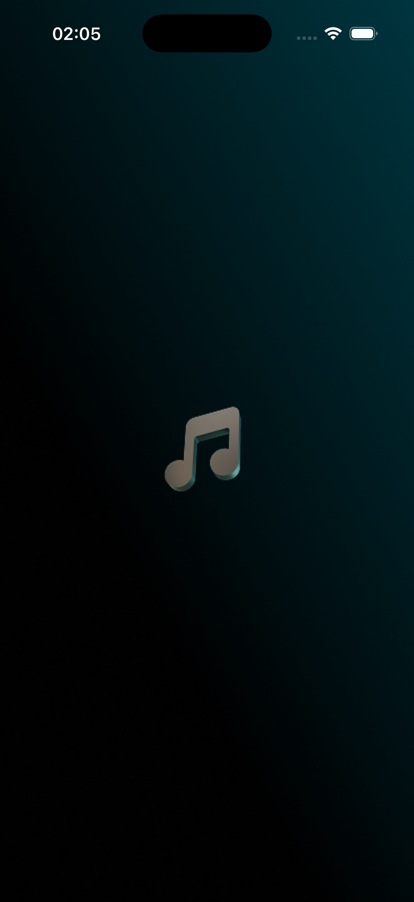<br/><b>Splash</b></td>
    <td align="center">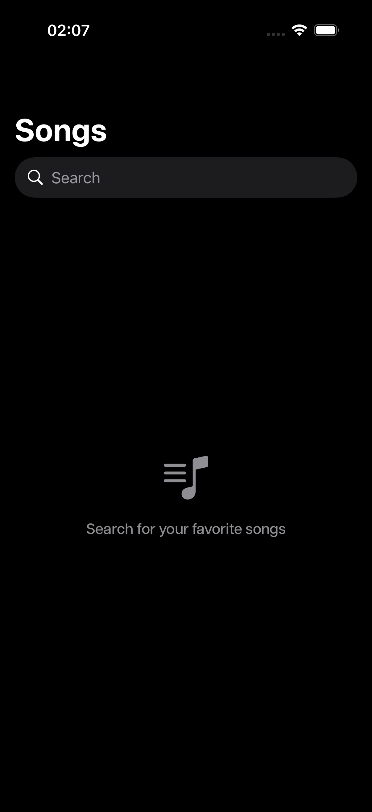<br/><b>Empty State</b></td>
    <td align="center"><br/><b>Recently Played</b></td>
  </tr>
  <tr>
    <td align="center">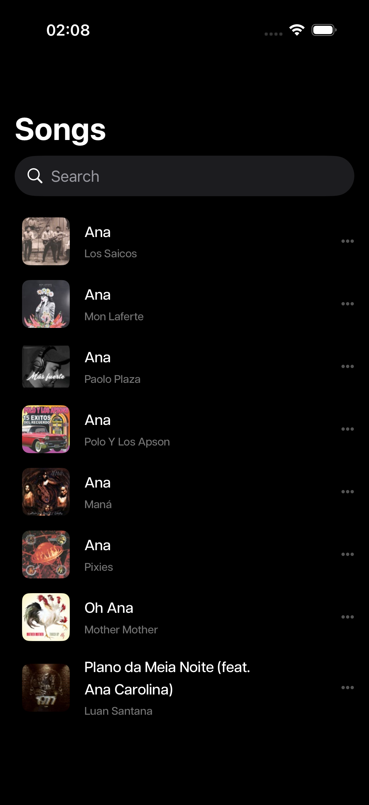<br/><b>Search Results</b></td>
    <td align="center">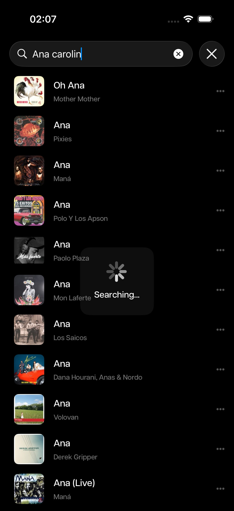<br/><b>Searching</b></td>
    <td align="center">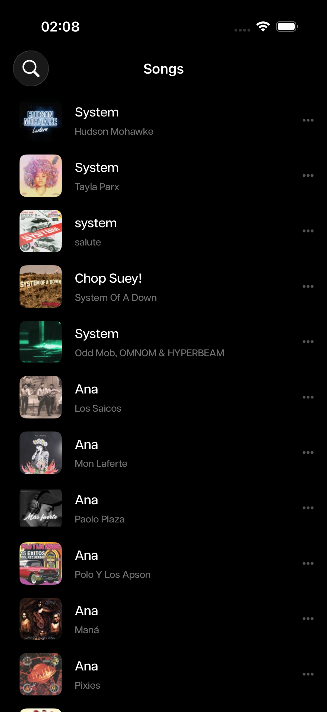<br/><b>Inline Search</b></td>
  </tr>
  <tr>
    <td align="center">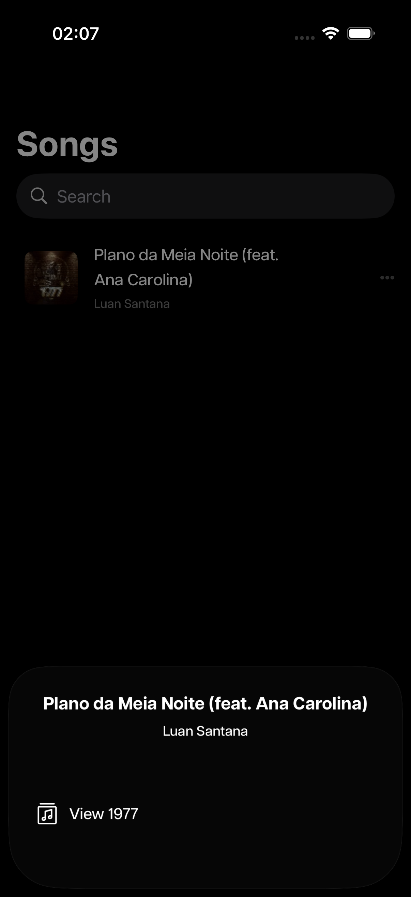<br/><b>Song Options</b></td>
    <td align="center">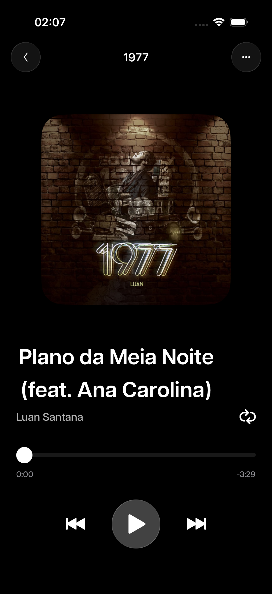<br/><b>Player</b></td>
    <td align="center">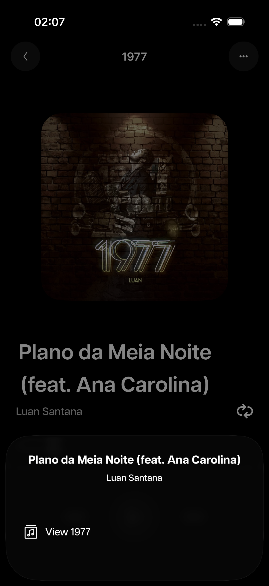<br/><b>Player Options</b></td>
  </tr>
  <tr>
    <td align="center">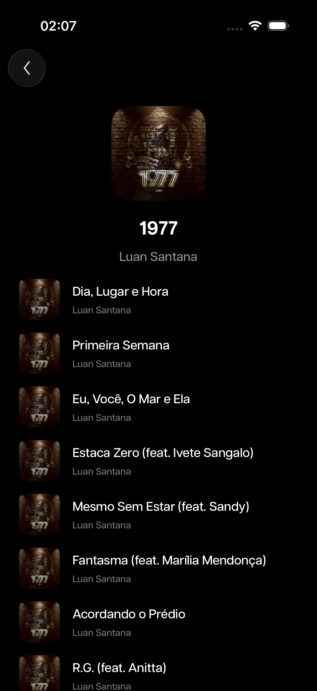<br/><b>Album</b></td>
    <td align="center">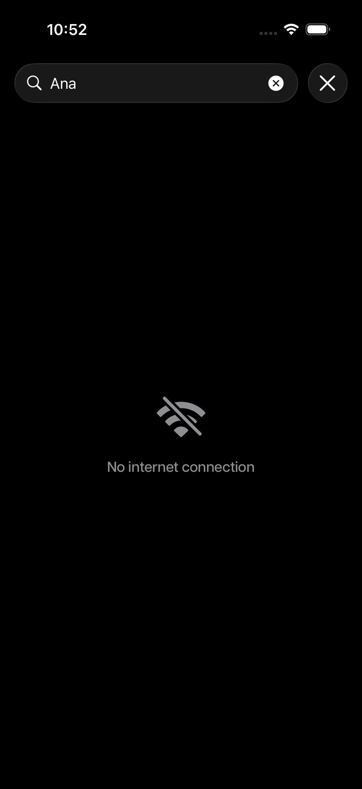<br/><b>No Connection</b></td>
    <td align="center">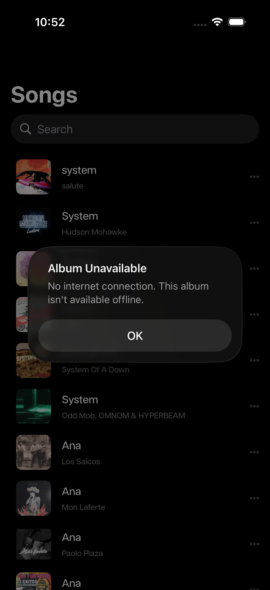<br/><b>Album Unavailable</b></td>
  </tr>
  <tr>
    <td align="center">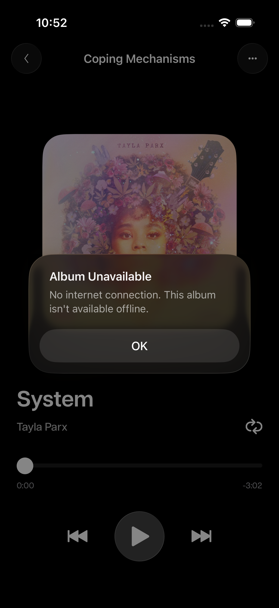<br/><b>Album Unavailable (Player)</b></td>
    <td></td>
    <td></td>
  </tr>
</table>
